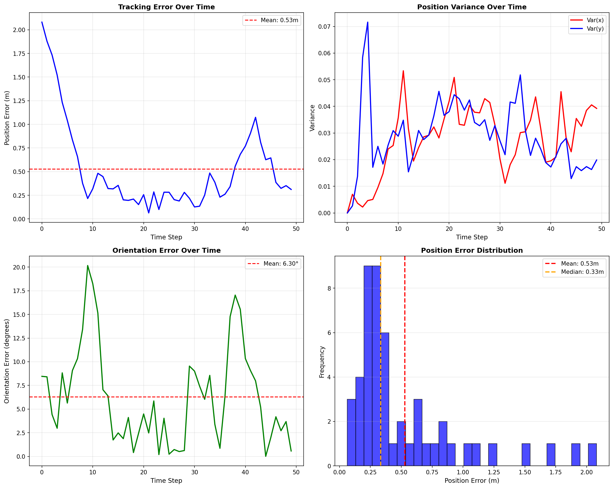
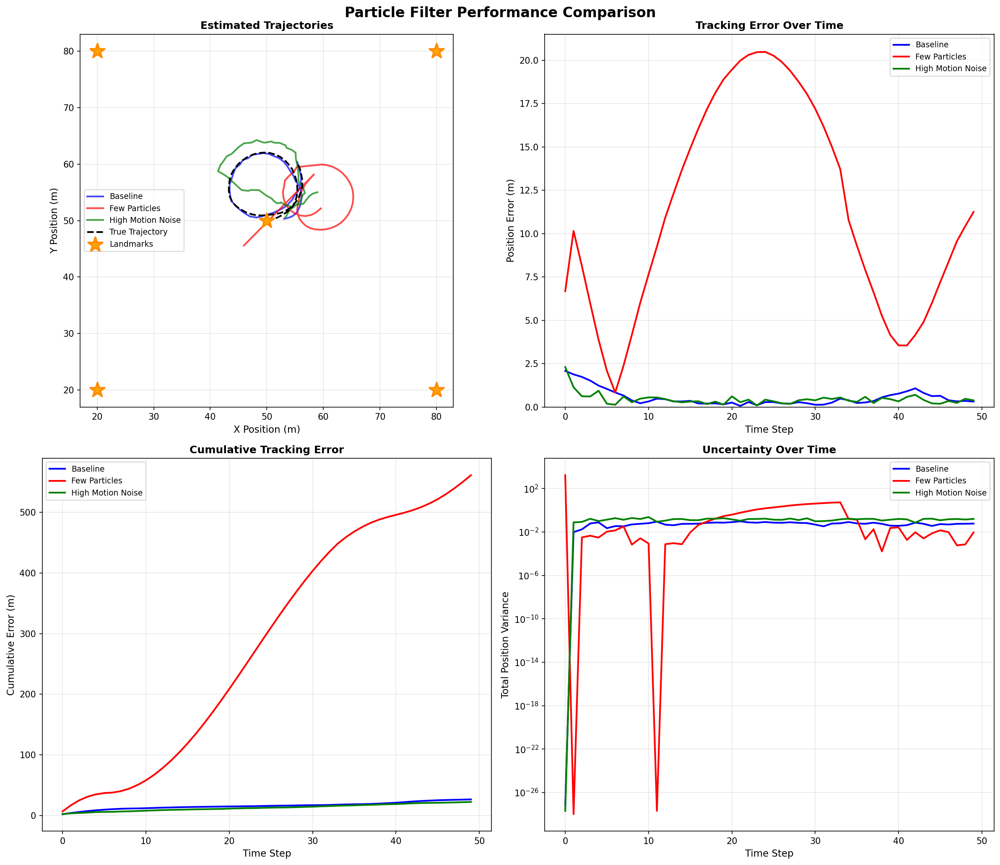
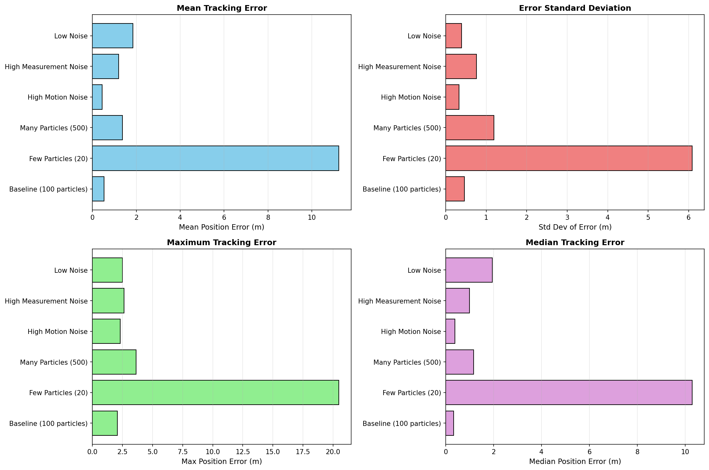

---

# **README — Particle Filter for Robot Tracking**

## **Overview**

This project implements and analyzes a Particle-Filter-based robot tracking system for a robot moving in a 2D environment with nonlinear motion and noisy sensor measurements.
The robot follows a circular trajectory by moving 1 meter forward and turning 10° left at every time step.
Gaussian noise affects both the robot’s true motion and its sensor readings.

A Particle Filter is used to approximate the robot’s belief by maintaining many parallel hypotheses (“particles”).
Particles are updated based on motion commands and noisy distance measurements to known landmarks.

This README provides a high-level summary of the system, experimental setup, results, and main insights.

---

# **Project Features**

## **Complete Particle Filter Pipeline**

Implements the three essential PF stages:

* Propagation (prediction)
* Update (sensor-based correction)
* Resampling (systematic resampling)

## **Realistic Robot Motion Model**

Includes three types of motion noise:

* Forward noise
* Turn noise
* Drift noise

## **Sensor Model**

The robot measures distances to five fixed landmarks with Gaussian noise.
Landmarks are positioned at coordinates:
(20,20), (80,20), (80,80), (20,80), (50,50).


# **Environment Setup**

* World size: 100 m × 100 m
* Simulation length: 50 steps
* Initial robot state: (50, 50, 0°)
* Motion command: 1 m forward + 10° left each step
* Resulting trajectory: Circular path

---

# **How the Particle Filter Works**

## 1. Propagation (Predict Step)

Each particle applies the motion command with Gaussian noise added to:

* forward displacement
* turning angle
* heading drift

This models motor inaccuracies, slip, and orientation uncertainty.

## 2. Update (Correction Step)

Each particle computes expected distances from its position to all landmarks.
Weights are assigned based on how closely these expected measurements match the robot’s noisy sensor readings.

Particles that better explain the measurements receive higher weight.

## 3. Resampling

Systematic resampling selects particles proportional to their weight.
Good hypotheses survive; weak ones are replaced.
This prevents weight collapse and focuses computation on probable regions.

---

# **Experiments Conducted**

As described in the report (pages 4–6) :

| Experiment             | Particles | Motion Noise | Sensor Noise | Purpose                        |
| ---------------------- | --------- | ------------ | ------------ | ------------------------------ |
| Baseline               | 100       | Moderate     | 0.5          | Reference                      |
| Few Particles          | 20        | Moderate     | 0.5          | Study insufficiency            |
| Many Particles         | 500       | Moderate     | 0.5          | Study diminishing returns      |
| High Motion Noise      | 100       | High         | 0.5          | Study value of exploration     |
| High Measurement Noise | 100       | Moderate     | High         | Sensor degradation             |
| Low Noise              | 100       | Low          | Low          | Investigate particle depletion |

---

# **Key Results**

## High Motion Noise (Best Overall)

* Mean error: **0.446 m**
* Success rate: **96%**

Increased motion noise improves particle diversity and prevents collapse.

## Baseline (100 particles)

* Mean error: **0.528 m**
* Error <1 m for **86%** of steps
* Stable, robust tracking

## Few Particles (20)

* Mean error: **11.226 m**
* Complete divergence; particles unable to represent belief

## Many Particles (500)

* Mean error: **1.372 m**
* Needs longer simulation to converge

## High Measurement Noise

* Mean error: **1.188 m**
* Weak sensor information slows convergence

## Low Noise (Motion + Measurement)

* Mean error: **1.850 m**
* Insufficient noise → particle collapse → overconfident failure

---

# **Selected Visualizations**

Only 3 visualization categories are presented here:

### 1. Particle Filter Evolution

Shows convergence from wide initial uncertainty to accurate tracking
(Examples shown in report pages 6–9) .



### 2. Tracking Error Over Time

Rapid convergence in the first 10 steps, stabilizing around ~0.5 m
(Report page 10) .




### 3. Comparative Experiment Bar Charts

Clear comparison of mean error, variance, and median error
(Report pages 12–13)




---

# **Insights and Lessons Learned**

## Particle Count

* 100 particles optimal
* Fewer than 50 → catastrophic failure
* More than 200 → diminishing returns
  (Supported by report page 16) .

## Motion Noise Importance

Low motion noise leads to particle depletion and inability to explore
(Page 17) .

## High Measurement Noise

Large sensor noise fundamentally limits accuracy
(Page 17) .

## Particle Depletion as Primary Failure Mode

Occurs when particles collapse into a narrow cluster
(Pages 18–20) .

---

# **Project Structure**

```
.
├── particle_filter_tracking.py       # Main simulation + visualizations
├── create_comparisons.py             # Runs all experiments and plots
├── outputs/                          # Generated images
└── report.pdf                        # Full analysis and documentation
```

---
## **How to Run**

### 1. Create and activate a virtual environment

```bash
python3 -m venv venv
source venv/bin/activate   # On Linux/Mac
# OR
venv\Scripts\activate      # On Windows
```

### 2. Install all required libraries

```bash
pip install -r requirements.txt
```

### 3. Run the main simulation

```bash
python3 particle_filter_tracking.py
```

### 4. Run all comparative experiments

```bash
python3 create_comparisons.py
```

All visualizations will be saved automatically in the `outputs/` directory.


---
